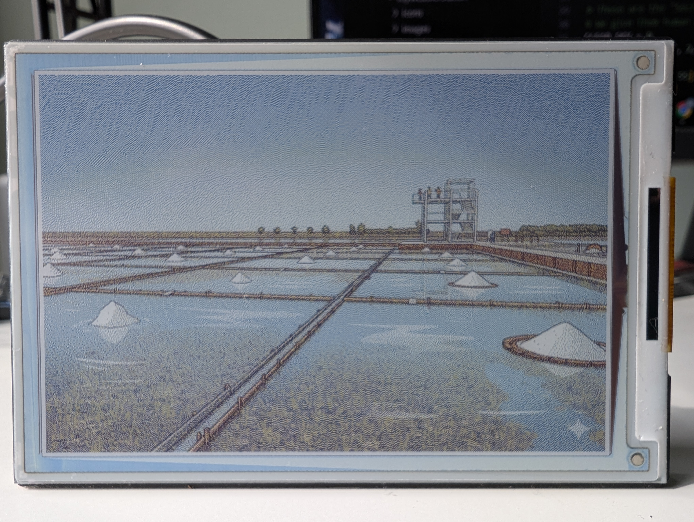

# 🏗️ InkPress Solo

Welcome, Lead Engineer! This guide is your very first mission. Before we can build a complex E-Paper Weather Station, we need to learn how to make our hardware talk! In this project, we will take a single picture and "print" it onto our digital screen.

## 🎓 What We Will Learn Today
* **Hardware Building:** What makes up a tiny computer system.
* **Command Line Magic:** How to give a computer instructions using only text.
* **Remote Control:** How to use your laptop to secretly code on the Raspberry Pi over Wi-Fi.
* **Python Power:** How a Python program resizes an image and sends it to an E-Ink display.

---

## 🛒 Part List (Hardware)
Before we start, make sure you have your "bricks" ready:

1. **The Brain:** [Raspberry Pi Zero 2 W Basic Kit with Color-Coded Pre Soldered Header](https://www.amazon.com/dp/B09LTDQY2Z?ref=ppx_yo2ov_dt_b_fed_asin_title) 
2. **The Face:** [Waveshare 4inch E Ink Spectra 6 (E6) Full Color E-Paper Display](https://www.amazon.com/dp/B0DHTNHRRY?ref=ppx_yo2ov_dt_b_fed_asin_title) 
3. **The Memory:** [32GB Ultra® microSDHC Card For Raspberry PI OS](https://www.amazon.com/gp/product/B08L5HMJVW/ref=ox_sc_act_title_2?smid=A35BKAA6VXTYCT&psc=1)
4. **The Energy:** [Micro USB Power Adapter](https://www.amazon.com/gp/product/B00MARDJZ4/ref=ox_sc_act_title_1?smid=A30ZYR2W3VAJ0A&psc=1)

---

## 🏗️ The 4 Levels of Your Project
To understand how your gadget works, we look at it in four layers. Each layer relies on the one below it to work properly. 


| Level | Name | Car Equivalent | Why it fits |
| :--- | :--- | :--- | :--- |
| **Level 4** | **The App** | **The Driver** | The driver decides the goal. Without a driver, the car just sits there! |
| **Level 3** | **Library** | **Power Steering & GPS** | These are special "helpers." You *could* turn the wheels manually, but Power Steering makes it easy. GPS tells you the route so you don't have to draw every map yourself. |
| **Level 2** | **The OS** | **Dashboard & Computer** | This is the "Boss" of the car. It manages the fuel (power) and tells the driver how the engine is doing via the dashboard. |
| **Level 1** | **Hardware** | **Engine, Wheels & Chassis** | This is the physical "Body" of the car. The metal, the rubber, and the bolts. It is the actual machine that moves. |

---

## 🛠️ Step 1: Preparing the Brain (OS & Settings)

1. **Log in to your Pi:**
   Open a terminal on your laptop and type:
   `ssh YOUR_USER_NAME@YOUR_MACHINE_NAME.local`
   *(Replace with your actual username and the machine name you picked!)*

2. **Update the System:**
   This makes sure your Pi has the latest security and software patches.
   ```bash
   sudo apt-get update
   sudo apt-get upgrade -y
   ```

3. **Enable the "Talking Port" (SPI Interface):**
   The Pi needs this special port to send picture data to the E-Paper screen.
   * Run: `sudo raspi-config`
   * Go to **Interface Options** > **SPI** > **Yes**.
   * Select **Finish** and reboot: `sudo reboot`

---

## 🛠️ Step 2: Installing Libraries & Drivers
Your station needs to learn how to draw shapes and how to talk to the screen.

1. **Install the Tools:**
   ```bash
   sudo apt-get install python3-pip python3-pil python3-numpy python3-requests python3-rpi.gpio python3-spidev git fonts-dejavu -y
   ```

2. **Download the Screen Driver:**
   This gives the Pi the "Instruction Manual" for your specific Waveshare screen.
   ```bash
   mkdir -p ~/MyProject
   cd ~/MyProject
   git clone [https://github.com/waveshare/e-Paper.git](https://github.com/waveshare/e-Paper.git)
   ```
   Skip this step if you downloaded the repository directly.

## 💻 Step 3: Coding with VS Code (SSH FS)
We use the **SSH FS** extension by **Kelvin Schoof** to edit files directly on the Pi without ever plugging a keyboard into it! 

1. **Install the Extension:**
   * In VS Code, go to **Extensions** (🧩).
   * Search for `SSH FS` by **Kelvin Schoof** and install it.

2. **Setup the Connection:**
   * Click the **SSH FS icon** in the sidebar (looks like two monitors).
   * Click the **+** button to add a configuration.
   * **Name:** `MyProject`
   * **Host:** `YOUR_MACHINE_NAME.local`
   * **User:** `YOUR_USER_NAME`
   * **Password:** (Your Pi password)
   * Click **Save**.

3. **Mount the Folder:**
   * Right-click your `MyProject` connection and select **Mount as workspace folder**.

4. **Download the Project:**
   Run this from your **Reapberry Pi** terminal:
   ```bash
   git clone https://github.com/CodePlusBuild/InkPressSolo.git
   ```

---

## 🧠 How the InkPress Solo Code Works
Before we run the test, let's understand what the Python program actually does! When you run the code, it acts like a digital artist:
1. **Finds the Screen:** It wakes up the E-Paper display so it is ready to draw.
2. **Loads the Picture:** It looks inside the `pictures` folder for a file named `test_image.png`.
3. **The Auto-Resizer:** If your picture is too big or too small, the code acts as a "Fixer" and squishes or stretches it to exactly 600 dots wide by 400 dots tall so it fits perfectly on the screen.
4. **The Flipper:** It rotates the image upside down (180 degrees) so it looks right side up when it is sitting in the case.
5. **Pushes the Ink:** It sends the final image to the screen and then goes to sleep!

---

## 🎨 Step 4: Light Up the Display (The Photo Test)
Let's make sure Level 1 (Hardware) and Level 2 (OS) are talking to each other!

1. **Transfer a test image:** Use SSH FS to put an image named `test_image.png` into your `pictures` folder on the Pi.
2. **Run the Test:**
   ```bash
   python3 ~/MyProject/InkPressSolo/InkPressSolo.py
   ```
   *If you see your picture, the hardware is working!*



---
**Great job, Engineer! Your e-ink display is fully operational.** 🌍🌬️
